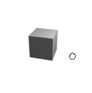

<div id="top"></div>

[![Storybook][storybook-shield]][storybook-url]
[![Contributors][contributors-shield]][contributors-url]
[![Forks][forks-shield]][forks-url]
[![Stargazers][stars-shield]][stars-url]
[![Issues][issues-shield]][issues-url]
[![MIT License][license-shield]][license-url]
[![LinkedIn][linkedin-shield]][linkedin-url]

<!-- PROJECT LOGO -->
<br />
<div align="center">

  <h3 align="center">React 360 Product Viewer</h3>

  <p align="center">
    Let your users view your product or 3D renders using mouse/touch or set it to autoplay!
    <br />
    <a href="https://todilo.github.io/react-360-product-viewer">See it in action in storybook</a>
    ·
    <a href="https://github.com/Todilo/react-360-product-viewer/issues">Report Bug</a>
    ·
    <a href="https://github.com/Todilo/react-360-product-viewer/issues">Request Feature</a>
  </p>
</div>

<!-- TABLE OF CONTENTS -->
<details>
  <summary>Table of Contents</summary>
  <ol>
    <li>
      <a href="#about-the-project">About The Project</a>
      <ul>
        <li><a href="#built-with">Built With</a></li>
      </ul>
    </li>
    <li>
      <a href="#getting-started">Getting Started</a>
      <ul>
        <li><a href="#prerequisites">Prerequisites</a></li>
        <li><a href="#installation">Installation</a></li>
      </ul>
    </li>
    <li><a href="#usage">Usage</a></li>
    <li><a href="#roadmap">Roadmap</a></li>
    <li><a href="#contributing">Contributing</a></li>
    <li><a href="#license">License</a></li>
  </ol>
</details>

<!-- ABOUT THE PROJECT -->

## About React 360 Product Viewer

<p align="center">
  
</p>

There are a few javascript product viewers out there but none could deliver what I needed. A React component written in Typescript and free!
With a lot of customization you can quickly setup this component. All you need is a set of images that represents an animation you would like your users to explore. Either through user-interaction or setting it to autoplay! Point the component to your image folder, set the name, count and image type and you are ready!

It can be controlled either using mouse or touch!

Main features:

- React component
- Uses Typescript
- Free
- Simple

<p align="right">(<a href="#top">back to top</a>)</p>

### Built With

- [React.js](https://reactjs.org/)
- [styled-components](https://styled-components.com/)
- [Rollup](https://rollupjs.org/guide/en/)
- [Storybook](https://storybook.js.org/)

<p align="right">(<a href="#top">back to top</a>)</p>

<!-- GETTING STARTED -->

## Getting Started

WARNING: This project is not yet available for download using NPM , the following test is merely a stub. Will be updated when the component is ready to be used.

### Prerequisites

_React_
In order to use the component you need a _React_ project. This was built and tested with 17.0.2 but other versions should work.

### Installation

_Make sure you have a react project - otherwise use: ._

```sh
  npx create-react-app my-app --template typescript
```

1. Download through npm

```sh
 npm add react-360-product-viewer
```

3. Add the component to your page, change the properties to fit your need. For all options see storybook

```typescript
<React360Viewer
  imagesBaseUrl="./imageSeries/"
  imagesCount={YOUR_IMAGE_SERIES_COUNT_HERE}
  imagesFiletype="png"
  mouseDragSpeed={20}
/>
```

<p align="right">(<a href="#top">back to top</a>)</p>

<!-- USAGE EXAMPLES -->

## Usage

TODO: Add descriptions of all parameters
_For more example and a playground please refer to [storybook](https://todilo.github.io/react-360-product-viewer)_

<p align="right">(<a href="#top">back to top</a>)</p>

<!-- ROADMAP -->

## Roadmap

- [x] Add rotate icon
- [x] Start image index
- [ ] Set autoplay to look x number of times
- [ ] Release for NPM
- [ ] Document API
- [ ] Allow for external URI:s as imagesources
- [ ] Example on how to layout images
- [ ] Add inertia
- [ ] Supply events
  - [ ] Autoplay finished
  - [ ] Image changed
  - [x] User key Down
  - [x] User key release
  - [x] User movement

See the [open issues](https://github.com/Todilo/react-360-product-viewer/issues) for a full list of proposed features (and known issues).

<p align="right">(<a href="#top">back to top</a>)</p>

<!-- CONTRIBUTING -->

## Contributing

Contributions are what make the open source community such an amazing place to learn, inspire, and create. Any contributions you make are **greatly appreciated**.

If you have a suggestion that would make this better, please fork the repo and create a pull request. You can also simply open an issue with the tag "enhancement".
Don't forget to give the project a star! Thanks again!

1. Fork the Project
2. Create your Feature Branch (`git checkout -b feature/AmazingFeature`)
3. Commit your Changes (`git commit -m 'Add some AmazingFeature'`)
4. Push to the Branch (`git push origin feature/AmazingFeature`)
5. Open a Pull Request

<p align="right">(<a href="#top">back to top</a>)</p>

<!-- LICENSE -->

## License

Distributed under the MIT License. See `LICENSE.txt` for more information.

<p align="right">(<a href="#top">back to top</a>)</p>

<!-- MARKDOWN LINKS & IMAGES -->
<!-- https://www.markdownguide.org/basic-syntax/#reference-style-links -->

[contributors-shield]: https://img.shields.io/github/contributors/Todilo/react-360-product-viewer.svg?style=for-the-badge
[contributors-url]: https://github.com/Todilo/react-360-product-viewer/graphs/contributors
[forks-shield]: https://img.shields.io/github/forks/Todilo/react-360-product-viewer.svg?style=for-the-badge
[forks-url]: https://github.com/Todilo/react-360-product-viewere/network/members
[stars-shield]: https://img.shields.io/github/stars/Todilo/react-360-product-viewer.svg?style=for-the-badge
[stars-url]: https://github.com/Todilo/react-360-product-viewer/stargazers
[issues-shield]: https://img.shields.io/github/issues/Todilo/react-360-product-viewer.svg?style=for-the-badge
[issues-url]: https://github.com/Todilo/react-360-product-viewer/issues
[license-shield]: https://img.shields.io/github/license/Todilo/react-360-product-viewer.svg?style=for-the-badge
[license-url]: https://github.com/Todilo/react-360-product-viewer/blob/master/LICENSE.txt
[linkedin-shield]: https://img.shields.io/badge/-LinkedIn-black.svg?style=for-the-badge&logo=linkedin&colorB=555
[linkedin-url]: https://www.linkedin.com/in/christian-klinton-ba408a33/
[storybook-shield]: https://img.shields.io/badge/-Storybook-FF4785?style=for-the-badge&logo=storybook&logoColor=white
[storybook-url]: https://todilo.github.io/react-360-product-viewer
[product-screenshot]: readme-examples/example1.gif
